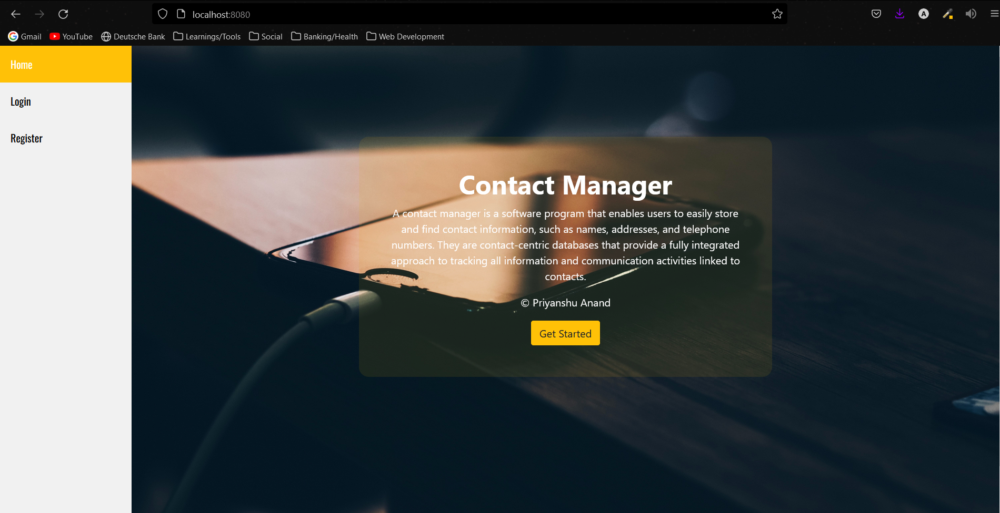
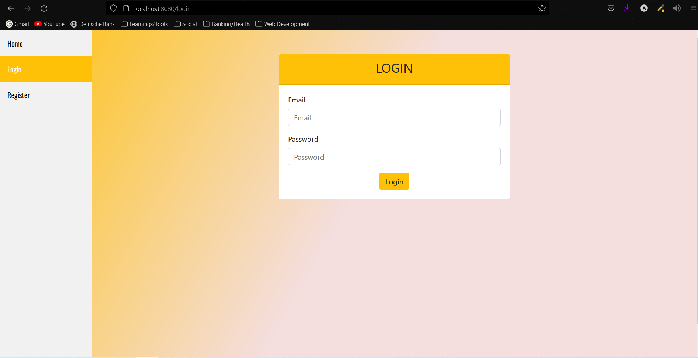
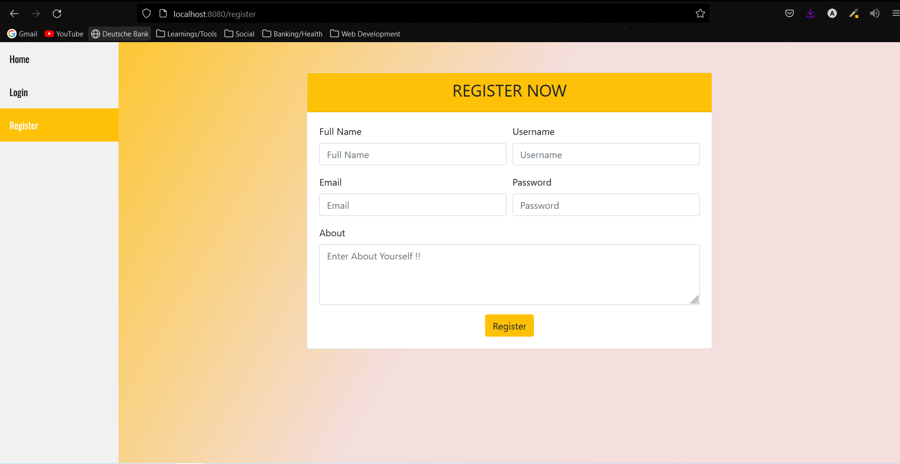
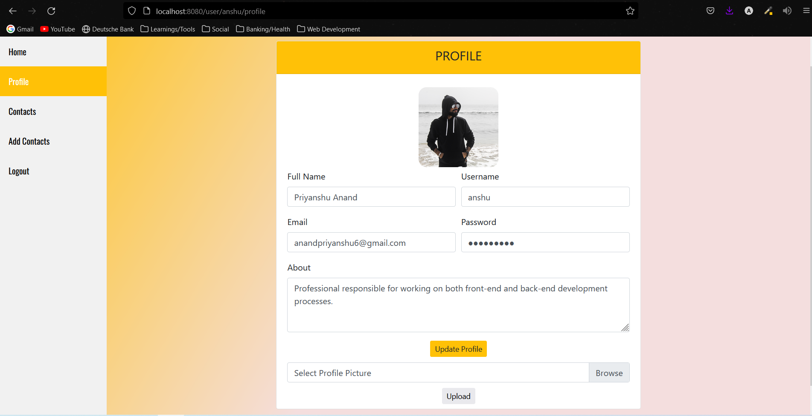
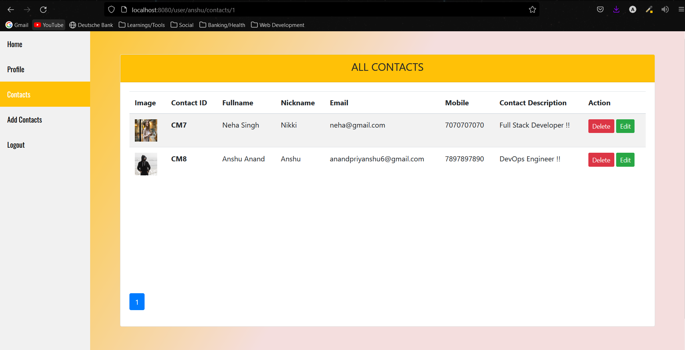

# ContactManager
A contact manager is a software program that enables users to easily store and find contact information, such as names, addresses, and telephone numbers. They are contact-centric databases that provide a fully integrated approach to tracking	all information and communication activities linked to contacts.
 
##### HOME PAGE


##### LOGIN PAGE


##### REGISTER PAGE


##### PROFILE PAGE


##### CONTACTS PAGE


### QUICK GUIDE/STEPS TO RUN THE PROJECT:
1. Clone the project.
2. Download "STS [ Spring Tool Suite ] IDE and Configure It.
3. Download/Install/Configure Java 8 or above.
4. Download and install MySQL installer community [ Workbench, MySQL command line ,MySQL Server ]
5. Download and Configure Tomcat 9.0 [ Optional ].
6. The Projects needs to have database created as below and rest of the table creation will be taken care by Hibernate itself : 

```
create database contactmanager;
```
7. Open STS IDE and import the cloned Project , Run the project as SpringBoot App.
8. Visit http://localhost:8080/home for home page in your browser.

Enjoy ContactManager !! 😊
